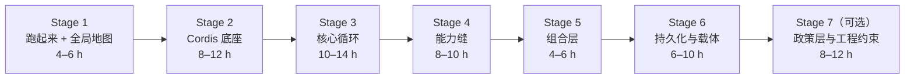

# 学习计划：DeepSeek Harness（`dsh`）

> 把一个陌生的大型仓库，转成可执行的学习计划。

## 学习目标

**掌握 `deepseek-harness` 的架构与插件化开发方式**：能读懂它的核心循环、能定位任何能力属于哪一层、能独立扩展它（加工具、加 provider、加策略、组 profile），并理解它为什么这样切分。

| 维度 | 设定 |
|---|---|
| 学习对象类型 | 代码仓库（含体系化文档与可执行教程） |
| 深度 | `standard`（系统掌握，6 个阶段 + 1 个可选深阶段） |
| 假设的起点 | 会写 TypeScript；用过插件式框架；**不需要** agent 领域知识 |
| 不建议的起点 | 完全没写过 TypeScript 或异步代码——请先补齐，否则 Stage 2 会卡住 |
| 估计总时长 | 40–60 小时（Stage 1–6；可选 Stage 7 另计 8–12 小时，不含收尾项目） |

**这不是一份"读完就懂了"的文档集，而是一份"必须动手"的路线。** 每个阶段都以可执行命令或可观察现象作为出口条件。

---

## 这个仓库为什么值得单独做学习计划

它有三个容易让自学者翻车的特征：

1. **规模**：50 个分组、268 个包，按目录字母序读必然迷路。
2. **概念耦合**：Cordis 的 effect 语义 → 装配出的插件树 → 循环 → 缝。跳一步就会得到"看懂了但结论是错的"。
3. **反直觉约束多**：注册即副作用、waterfall 必须 `next()`、模型可见即已记录、事件默认拒绝加载未知类型……这些不是风格偏好，而是有运行时断言保护的契约。

好消息是：**仓库自带两条成体系的教程**（Cordis 7 章动手教程 + Harness 插件开发入门），所以这份计划的主要价值是**编排顺序、划清边界、给出验收标准**，而不是重写内容。

---

## 文件导航

| 文件 | 内容 | 什么时候看 |
|---|---|---|
| [roadmap.md](roadmap.md) | 分阶段路线（目标 / 概念 / 任务 / 验收 / 失败模式） | **从这里开始**，全程当作主索引 |
| [concepts.md](concepts.md) | 核心概念知识地图 + 依赖图 + 自检清单 | 每阶段开始时查表；阶段结束时用自检清单验收 |
| [architecture.md](architecture.md) | 架构分析（Mermaid 图：分层、组合、循环、日志、工具管线、载体） | Stage 3 之前通读一遍，Stage 5/6 再回来细读 |
| [source-reading.md](source-reading.md) | 23 个关键文件的导读（15 必读 + 8 按需）（为什么读 / 读什么 / 验收 / 先跳过什么） | 每阶段进入源码阅读时按组取用 |
| [exercises.md](exercises.md) | 20 个实践任务（理解 → 修改 → 创造）+ 收尾项目 | 每阶段至少完成 2 个任务后再推进 |
| [diagrams/](diagrams/) | 8 张图的 Excalidraw 可编辑副本（与 `README.md`/`concepts.md`/`architecture.md` 中的 Mermaid 图一一对应） | 想改图、放大细看或在白板上讲给别人听时 |

阅读顺序建议：**roadmap →（对应阶段）concepts → architecture → source-reading → exercises**。`architecture.md` 和 `concepts.md` 内容有重叠，前者讲"怎么流动"，后者讲"怎么用词"，重叠处是刻意的——同一个事实需要两种心智模型。

---

## 快速开始（30 分钟）

```sh
# 1. 环境
pnpm install
pnpm run typecheck                 # 通过即代表环境 OK

# 2. 让它跑起来（需要 DEEPSEEK_API_KEY；无 key 见下一节）
pnpm run build
pnpm dsh web                       # 打开 http://127.0.0.1:3080

# 3. 看见它实际挂载了什么（最有用的一条命令）
pnpm dsh --profile web --dump-config

# 4. 无 key 的替代路径：脚本化模型端点
pnpm run mock:llm --port 8000 --api-key mock-key --sequence partial_disconnect,success
```

**无 API key 怎么学**：仓库的默认设置就是"没有密钥也能推进"——单元测试、快照回放、mock 模型服务器、e2e 自跳过，全部 keyless。只有真实驾驶 agent 的场景才需要 key。

紧接着做 [exercises.md](exercises.md) 的**练习 1.1 与 1.2**——它们只需要 30 分钟，但会立刻给你一张可用的地图。

---

## 建议学习顺序



| 阶段 | 一句话目标 | 出口条件 |
|---|---|---|
| 1 | 让 `dsh` 在你机器上跑起来，建立"东西在哪"的索引 | `--dump-config` 能逐段说出出处 |
| 2 | 能独立写一个可装载、带校验、注册服务、派发事件的 Cordis 插件 | 插件能热装热卸且副作用干净回滚 |
| 3 | 能讲清"一条用户消息如何变成一次模型请求与持久事实" | 能从 JSONL 里按序列出一次真实 turn |
| 4 | 能新增一个工具或一个 provider，且不改动消费者 | 新工具自动进 prompt，卸载后干净消失 |
| 5 | 能解释同代码如何启动出四种产品，并能精确覆盖一行 | patch 只影响目标行；自定义 profile 可运行 |
| 6 | 理解会话格式的长期契约与 Host/Client 双面通信 | 能书面推演出一次安全的格式演进 |
| 7（可选） | 从"会用"到"能改产品行为"，并理解工程约束的因果 | 一次真实改动通过相关门与快照 |

**推进规则**：不要"读完了就推进"，要"验收标准通过才推进"。每一阶段的验收标准都是命令或可观察现象，见 [roadmap.md](roadmap.md)。

---

## 三条学习原则

1. **先跑再读。** 这个仓库的文档密度极高，但它的正确性只在运行时显现。任何"我理解了"的判断都应该有一个命令或一次观察支撑。
2. **先读接口再读实现。** `packages/core/agent/src/types.ts` 只有 95 行，却定义了扩展插件唯一允许依赖的接口；先读 600 行的驱动是本末倒置。这个仓库的包 README 是按契约写的，通常比源码注释更省时间。
3. **用 agent 辅助探索，但自己验证结论。** 仓库自己在 [docs/architecture.md](../docs/architecture.md) 里就推荐了这种做法。适合交给 agent 的：定位某概念在哪些文件出现、汇总某目录的职责、找某个约束的所有实例。**必须自己做的**：判断一个机制属于哪一层、判断某扩展点是否是正确的落点、判断一次验收是否真的通过。

---

## 语言与文档选择

- 本计划用中文书写，技术术语保留英文原文。
- 仓库绝大多数文档有中文配对版本（`docs/architecture.zh.md`、`packages/**/README.zh.md`），中文阅读更快时直接用中文版。
- 但**以英文版为技术契约的权威**：中文版是配对维护的译文，`packages/` 下的 API 与 JSDoc 以源码为准。
- 中文文档与英文文档由配对门校验一致性，所以两者内容应当是等价的——不一致时按英文版理解。

---

## 本目录的性质

`learning/` 是**学习产物，不属于仓库文档体系**：

- 不参与任何仓库门（`verify-md-wrap`、`verify-md-links`、`verify-doc-budgets`、翻译配对等的作用域都不含本目录）。
- 唯一权威始终是 `docs/` 与源码；本目录的任何陈述若与之冲突，以仓库为准。
- 行号会随重构漂移，请用符号名（类名/函数名）搜索定位，不要硬编码行号。
- 若要把这里的结论反馈回仓库，应该落在 [docs/AGENTS.md](../docs/AGENTS.md) 规定的层级（bugs → postmortem，rationale → Agent Note，procedures → cookbook，type definitions → subsystems）。

---

## 下一步

从 [roadmap.md](roadmap.md) 的 **Stage 1** 开始；进入源码阅读时打开 [source-reading.md](source-reading.md) 的组 A；每阶段收尾用 [exercises.md](exercises.md) 对应任务做验收。
