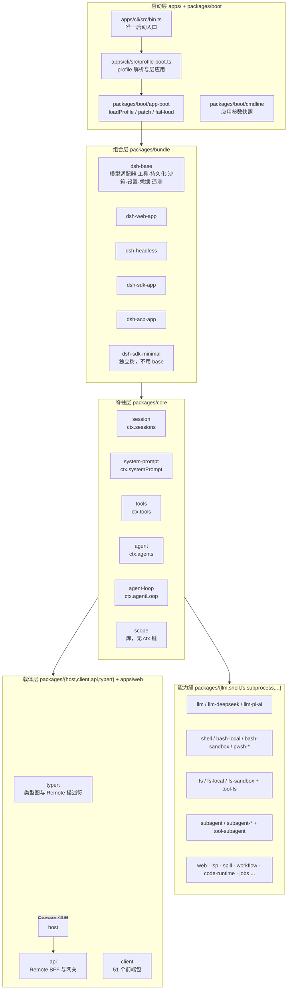
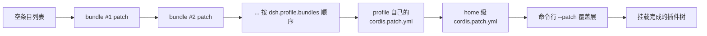
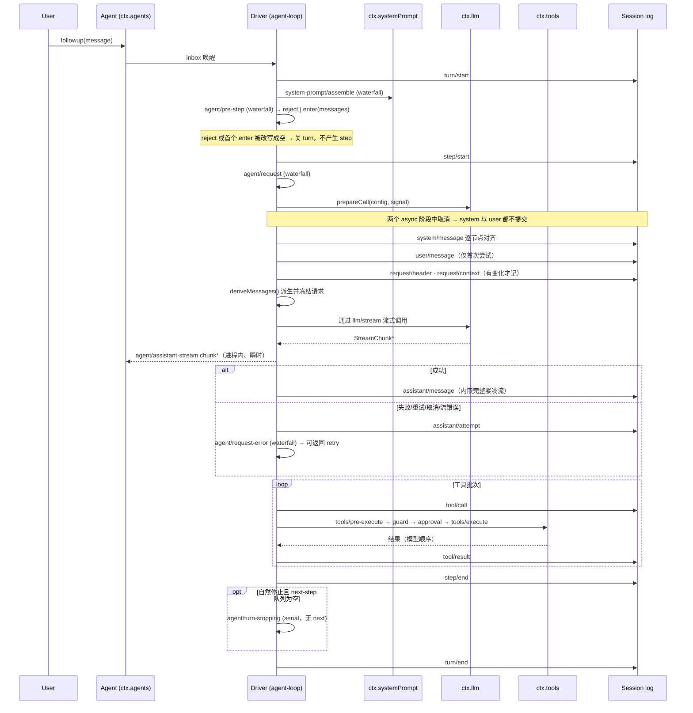
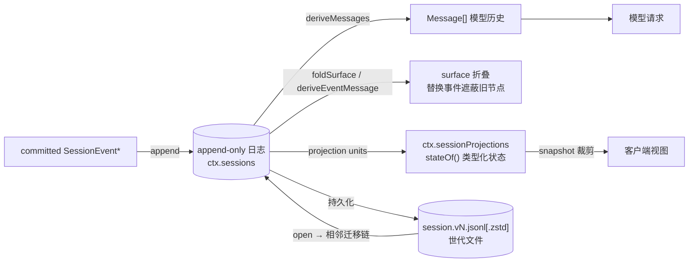
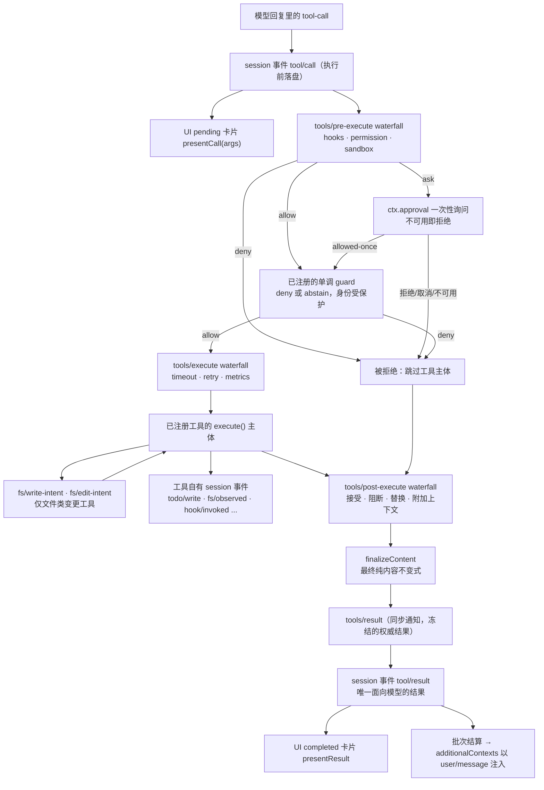
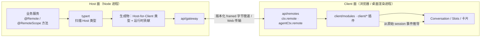

# 架构分析

本文件回答三个问题：`dsh` **由什么组成**、**数据如何流动**、**为什么这样切分**。图全部用 Mermaid 编写，可在支持 Mermaid 的编辑器中直接渲染。

- 权威文档：[docs/architecture.md](../docs/architecture.md)（变更 `packages/` 前必读）
- 术语表：[docs/glossary.md](../docs/glossary.md)
- 自动生成的能力图：[docs/capability-seams.md](../docs/capability-seams.md)、模块图 [docs/module-graph.md](../docs/module-graph.md)

---

## 1. 定位与技术栈

`dsh` 是一个 **all-plugin** 的 agent harness：Cordis 框架之上，模型适配器、工具注册表、会话日志、乃至 agent 主循环本身都是插件。因此**没有特权内核可以打补丁**——扩展方式是"在别人旁边挂一个插件"。

| 维度   | 事实                                                         | 依据                                                                      |
| ---- | ---------------------------------------------------------- | ----------------------------------------------------------------------- |
| 运行时  | Node `^22.19 \|\| >=24`，全 ESM                              | 根 [package.json](../package.json)                                       |
| 包管理  | pnpm workspace，`packages/<group>/<pkg>`                    | 根 [package.json](../package.json)                                       |
| 插件框架 | 自带 `vendor/cordis`（含 loader / schemastery / hmr / include） | [vendor/README.md](../vendor/README.md)                                 |
| 语言   | TypeScript `strict` + `noImplicitAny`                      | 根 [AGENTS.md](../AGENTS.md)                                             |
| 编译面  | Host / Client 两个独立聚合程序                                     | [docs/development.md](../docs/development.md#typescript-project-layout) |
| 规模   | 50 个分组、268 个包                                              | `ls -d packages/*/` 与 `packages/*/*/package.json`                       |

---

## 2. 分层总览

读图要点：

- **只有一条启动路径**：`apps/cli/src/bin.ts`。package bin、demo、直接 in-process 挂载插件都不是合法应用启动方式，由 [scripts/verify-application-entrypoints.ts](../scripts/verify-application-entrypoints.ts) 强制。
- **组合层不含逻辑**，只含"哪些行、按什么顺序"；真正的行为全在脊柱层与能力缝。
- **载体层是可选消费者**：`sdk-minimal` 不挂 Web/Client，同一个循环照样跑。

---

## 3. 组合层：一个 profile 如何变成一棵插件树

| 概念 | 位置 | 说明 |
|---|---|---|
| profile 模板表 | `packages/boot/app-boot/src/profile.ts:105-125` | `PROFILE_TEMPLATES`：`web`/`headless`/`sdk`/`acp` = base + 对应 app；`sdk-minimal` 只有自己的独立 bundle |
| profile 生成 | `packages/boot/app-boot/src/profile.ts:177` | 往 profile 的 `package.json` 写入 `dsh.profile = { bundles, patchReload }` |
| bundle 声明 | `packages/bundle/base/package.json:31-35` | `dsh.bundle.patch` 指向自己的 `cordis.patch.yml` |
| 补丁应用 | `vendor/include/src/index.ts:58` | `applyEntryPatches()`：按 id 命中行并整行替换 config，或插入新行 |
| 默认 reload | `packages/boot/app-boot/src/profile.ts:137` | `DEFAULT_PROFILE_PATCH_RELOAD = 'live'`；shipped 的 `headless`/`sdk`/`sdk-minimal`/`acp` 用 `startup` |
| home 解析 | `packages/util/home-paths/src/index.ts:87` | `resolveDshHome()` |

**为什么 `startup` profile 不能热改**：`web` 是长期驻留的 server，重新组合依赖不会破坏已有工作；而 `headless`/`sdk`/`acp` 是一次性或 stdio 应用，在它已经拥有工作之后再替换依赖会让那次生命周期失效。

---

## 4. 核心循环：turn / step

一个 **step** = 一次模型请求 + 它触发的工具；一个 **turn** = 零或多个 step，在首次认领输入之前开启、在不再欠工作时关闭。

实现锚点（`packages/core/agent-loop/src/agent.ts`）：

| 方法 | 行 | 职责 |
|---|---|---|
| `ReactLoopAgent` | 72 | 实现公共 `Agent` 契约的具体驱动 |
| `wakeDriver` | 187 | 唤醒策略（含取消收敛） |
| `kick` | 225 | 主驱动的外层循环 |
| `preStep` | 240 | 认领输入并作出 enter/reject 决定 |
| `turn` | 269 | 开 turn、循环 step、关 turn |
| `step` | 352 | 单次模型请求 + 工具批次 |
| `prepareRequest` / `buildRequest` | 501 / 553 | 请求构造与冻结 |

---

## 5. 会话日志：唯一真相来源

**Model-visible ⟺ logged**：任何进入模型请求的东西都必须能从日志重建，并有运行时 invariant 断言。这就是"新增模型可见输入必须先加 session event"的原因。

| 机制 | 锚点 | 关键约束 |
|---|---|---|
| `Session` 类 | `packages/core/session/src/index.ts:446` | `append()` 在 `:710`，`deriveMessages()` 在 `:832` |
| surface 投影 | `packages/core/session/src/surface.ts:92`（`deriveEventMessage`）、`:487`（`foldSurface`）、`:504`（`SurfaceManager`） | 替换事件遮蔽历史节点，**不做删除操作** |
| 写者版本常量 | `packages/core/session/src/types.ts:88` | `SESSION_FORMAT_VERSION = 3`，是代码中唯一手工维护的当前写者号 |
| 已发布格式 | [docs/session-format-status.md](../docs/session-format-status.md) | 记录 `latestReleasedVersion: 3` |
| 相邻迁移 | `packages/session/session-format-v0-to-v1`、`v1-to-v2`、`v2-to-v3` | **每个包只拥有一步** `vN -> vN+1` |
| JSONL provider | `packages/session/session-persistence-jsonl` | 拥有物理封装、压缩、世代选择、排他发布 |

**三条不可违反的世代规则**：已提交的世代路径永不重命名、覆盖、删除；`stat`/`list` 只看头部并选数值最高的规范世代；写打开先编码、校验，再在源文件旁边排他发布最终版本名的后继。

---

## 6. 工具执行管线

三个 waterfall 都可以**变换**调用；`tools/result` 只观察不可变的、无损 JSON 的结果。**为什么策略不进工具实现**：这样 hook 可以横跨工具家族，而不需要每个工具认识每一个策略服务。

需要区分的三段式拒绝语义：

1. `tools/pre-execute` 返回 deny —— 可被后续监听器的组合策略影响，是"装配出来的决策"。
2. `ctx.tools.guard()` —— **单调**：一旦拒绝，后面的监听器无法撤销。
3. `ctx.approval` —— 人类一次性授权；不可用（无人应答）按拒绝处理，绝不静默放行。

---

## 7. 能力缝地图

一条缝 = Service Definition（声明接口、持有 `ctx.<key>`）+ Service Provider（实现）+ Consumer（通常是一个模型可调用的 tool）。**只写一个 provider 不算完成一条缝。**

| 能力 | `ctx` 键 | Service Definition | 已知 Provider 示例 | Consumer 示例 |
|---|---|---|---|---|
| 会话日志 | `sessions` | `packages/core/session` | —（脊柱服务） | `agent-loop`、`session-query` |
| 提示词装配 | `systemPrompt` | `packages/core/system-prompt` | — | `agent-loop` |
| 工具注册表 | `tools` | `packages/core/tools` | — | `agent-loop`、`tool-*` |
| 活体 agent | `agents` | `packages/core/agent` | `packages/core/agent-loop` | `tool-subagent`、UI |
| 模型适配 | `llm` | `packages/llm/llm` | `llm-deepseek`、`llm-pi-ai`、`llm-retry` | `agent-loop` |
| Shell 执行 | `shell` | `packages/shell/shell` | `bash-local`、`bash-sandbox`、`pwsh-local`、`pwsh-sandbox` | `tool-bash`、`tool-pwsh` |
| 子进程 | `subprocess` | `packages/subprocess/subprocess` | local 进程树提供方 | `bash-local`、`tool-bash` |
| 文件系统 | `fs` | `packages/fs/fs` | `fs-local`、`fs-sandbox`、`fs-observation-policy` | `tool-fs`、`tool-fs-search`、`tool-str-replace-editor` |
| 进程隔离 | `sandbox` | `packages/sandbox/sandbox` | sandbox 后端 | 各 exec 类工具在 spawn 前包裹 argv |
| 持久终端 | `terminals` | `packages/terminal/terminal` | — | `tool-bash-persistent`、`tool-pwsh-persistent` |
| 工作流 | `workflowEngine` | `packages/workflow/workflow` | `workflow-worker-thread` | `tool-workflow`、`tool-ralph` |
| 代码运行 | `codeRuntime` | `packages/code-runtime/code-runtime` | `code-runtime-worker-thread` | PTC 模式的 `run_code` |
| 后台任务 | `jobs` | `packages/jobs/jobs` | — | `job_*` 工具 |
| 派生 agent | `subagents` | `packages/subagent/subagent` | `subagent-in-process`、`subagent-fork-in-process`、`subagent-acp`、`subagent-claude-code`、`subagent-codex`、`subagent-dsh-sdk` | `tool-subagent` |
| Web 访问 | `web` | `packages/web/web` | `web-search-deepseek`、`web-search-exa`、`web-search-perplexity`、`web-fetch-http` | `tool-web` |
| LSP 导航 | `lsp` | `packages/lsp/lsp` | LSP provider | LSP 工具 |
| 技能 | `skills` | `packages/skill/skill` | `skill-local` 等 | skill 目录/加载工具 |
| 上下文压缩 | `compaction` | `packages/compaction/compaction` | `compaction-basic`、`compaction-tool-result-pruner` | `agent/pre-step`、`agent/request-error` |
| 审批 | `approval` | `packages/interaction/user-approval` | 同包内含具体实现 | `tools/pre-execute` 管线 |
| 提问 | `userQuestions` | `packages/interaction/user-questions` | UI 提供方 | `tool-ask-user` |
| 人类命令 | `commands` | `packages/interaction/commands` | UI adapter | 各 `dsh-command-*` |
| 会话持久化 | `sessionPersistence` | `packages/session/session-persistence` | `session-persistence-jsonl`、`session-log-deepseek` | `agent-loop` |
| 会话投影 | `sessionProjections` | `packages/session/session-projection` | `session-projection-cache` | Host 读取方、客户端载体 |
| 会话标题 | `sessionTitle` | `packages/session/session-title` | `session-title-llm`、`session-title-first-prompt-llm` 等 | UI |
| 目标 | `goals` | `packages/goal/goal` | — | `dsh-command-goal`、goal 工具 |
| 存储 | `storage` | `packages/storage/storage` | 后端实现 | 各 domain 消费者 |
| 附件 | `attachments` | `packages/attachment/attachment` | `attachment-local` | `client-file-upload`、`tool-fs` |
| 溢写 | `spillStore` | `packages/spill/spill` | — | 工具输出溢出 |
| 设置 | `settings` | `packages/settings/settings` | 文件 provider | 各设置卡片 |
| 凭据 | `credentials` | `packages/credentials/credentials` | env / `.env` provider | 需要密钥的 provider |
| 运行时不变式 | `invariants` | `packages/runtime-diagnostics/invariants` | — | 断言"模型可见即已记录"等 |
| 遥测 | `sessionTelemetry` | `packages/session/session-telemetry` | `session-telemetry-otel` | 出站上报 |
| 工作区 | `workspaceRegistry` | `packages/workspace/workspace` | — | 会话 `cwd` 关系 |
| Webhook | `webhookRuntime` | `packages/webhook/webhook` | — | 外部事件创建会话 |
| Agent Teams | `agentTeams` | `packages/experimental/agent-team` | —（实验性） | 协调型工具 |

> 完整且实时的版本是自动生成的 [docs/capability-seams.md](../docs/capability-seams.md)（由 `pnpm run gen-doc-graphs` 生成，CI 有新鲜度门）。上表是精选导读，**不要**据此手改生成文件。

**换 provider 的连锁效应**：`fs` 与 `subprocess` 共享同一个"执行世界"。把它们都指向远端沙箱，Bash、PTY、LSP 会一起搬过去，**无需为任何 provider 分叉代码**。

---

## 8. Host / Client 双面载体

| 事实                                                                                                                                                                   | 依据                                                                                          |
| -------------------------------------------------------------------------------------------------------------------------------------------------------------------- | ------------------------------------------------------------------------------------------- |
| Host 与 Client 必须是两个 `ts.Program`：两侧在**同一个 key** 上做 declaration merging 会冲突，而该冲突只存在于一个 `ts.Program` 内                                                                 | [docs/development.md](../docs/development.md#typescript-project-layout)                     |
| 6 个包同时有 Host 与 Client 两个叶子配置（`api/remotes`、`api/gateway`、`api/session-controller`、`api/workspace-controller`、`client/connection`、`session-query/session-log-export`） | 同上                                                                                          |
| Typert 只在 Host tsdown 阶段运行，生成 Host 反射产物与 Host-for-Client Remote 投影                                                                                                   | 同上                                                                                          |
| Web 卡片**不消费** Host 的 `presentCall`/`presentResult`，而是从原始 `tool/call`、`tooxl/result`（含持久化 `result.meta`）推导                                                            | [docs/cookbook/adding-a-tool.md](../docs/cookbook/adding-a-tool.md#web-client-presentation) |
| 但 Host 侧 presenter **必须是纯函数**：录制与回放都会执行它                                                                                                                             | 同上                                                                                          |

---

## 9. 一条消息的完整旅程（跨层索引）

1. **CLI**：`dsh --profile web "..."` → `apps/cli/src/bin.ts` 解析 argv，选出 profile 与 patch 文件。
2. **组合**：`packages/boot/app-boot` 按 `dsh.profile.bundles` 顺序叠 patch，再叠 profile/home/`--patch` 层，挂载出插件树。
3. **入口**：`ctx.agents` 创建或恢复 agent（`create()` / `resume()`），返回 `AgentHandle`。
4. **入队**：`agent.send()/followup()` 写 inbox；唤醒型消息立刻驱动 driver。
5. **turn 开始**：`kick()` → `turn()` → `session.append('turn/start')`。
6. **认领与装配**：`preStep()` 认领输入 → `ctx.systemPrompt` 装配分节与工具 schema → `agent/pre-step` 作出决定。
7. **请求构造**：`step/start` → `agent/request` → `ctx.llm.prepareCall()` → 对齐 `system/message`、追加 `user/message`、按需记 `request/header` 与 `request/context` → 冻结请求。
8. **流式**：经 `llm/stream` waterfall 发起调用；chunk 通过 `agent/assistant-stream` 实时推给 UI，但**只有结算后的 `assistant/message` / `assistant/attempt` 才是持久事实**。
9. **工具**：`tool/call` 落盘 → 受保护管线 → `tool/result` 落盘；parallel-safe 调用走有界并发池，exclusive 调用是排序屏障。
10. **收尾**：`step/end` → 需要再问就再开一步 → `agent/turn-stopping` → `turn/end`。
11. **持久化**：已挂载后端把 `session/event` 批次路由进写句柄；`session/flush` 是屏障；关闭时先提交收尾事件再关句柄。
12. **呈现**：投影 unit 增量折叠 committed 事件，载体用 `snapshot()` 裁剪出一致切面给客户端模型渲染。

---

## 10. 为什么这样切分（设计约束的因果）

| 约束 | 原因 |
|---|---|
| 扩展插件只依赖 Service Definition，永不依赖具体 provider | 让 `dsh-agent-loop` 等实现可替换；依赖方向见 [packages/README.md](../packages/README.md#dependencies) |
| 注册走 `ctx.effect()` / `ctx.on()` | 卸载与热重载必须可预测地回滚 |
| 新行为挂扩展点，而不是改 `agent-loop` | 改循环要同步改架构文档；扩展点才是稳定接口 |
| 模型可见输入必须有对应 session 事件 | 否则 replay/fork/telemetry 无法重建模型看到的内容 |
| 部署相关取值必须是可校验的 `Config` 字段 | 插件里不许有硬编码 tunable；协议常量与安全不变式除外 |
| 显式 > 隐式（`resolve(request): Spec`） | 默认值必须可审计，不能藏在 `run()` 里 |
| 事件 `@mode` 是公开契约 | 派发模式决定了监听器能否短路、能否有返回值 |
| 空 `catch` 必须说明它吞掉了什么 | 避免静默失败；错误的失败模式是"看起来正常" |

---

## 11. 分组速查

| 分组 | 拥有 |
|---|---|
| `core/` | 会话日志、提示词装配、工具注册表、agent 类型与驱动、scope 原语 |
| `api/` `typert/` `host/` `client/` | Remote 装配与网关、类型图、宿主、浏览器插件 |
| `llm/` | 消息与流词汇、adapter 缝、DeepSeek 与第三方适配器 |
| `session/` | 持久化、格式版本与迁移、投影、标题、遥测、统计 |
| `shell/` `subprocess/` `terminal/` `fs/` `lsp/` `sandbox/` | 执行世界：命令、进程、终端、文件、语言服务、隔离 |
| `subagent/` `workflow/` `jobs/` `goal/` `plan/` `schedule/` | 委派与长时工作、目标、计划模式、提醒 |
| `interaction/` `hooks/` `preset/` `compaction/` `context/` `guard/` `skill/` | 人机交互、钩子桥、agent 预设、压缩、请求上下文、环卫生、技能 |
| `bundle/` `boot/` `preset/` | 组合与启动 |
| `web/` `webhook/` `mcp/` `acp/` `sdk/` | 外部入口协议 |
| `util/` `test-support/` `runtime-diagnostics/` | 零依赖工具、测试基础设施、诊断 |
| `experimental/` `e2b/` | 未发布原型（`e2b` 是 POC） |
