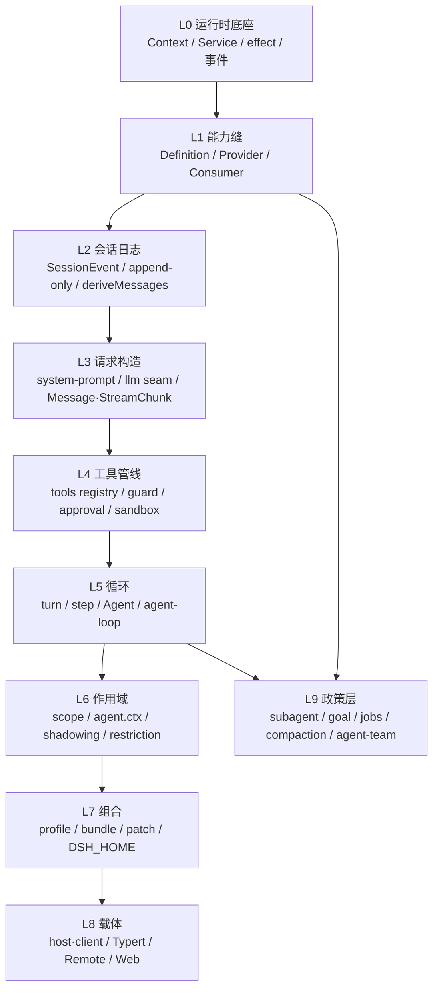

# 核心概念知识地图

本文件是学习计划的"词汇表 + 依赖图"。`dsh` 的学习曲线不是"文件多"，而是**概念环环相扣**：不理解 Cordis 的 effect 语义，就无法理解为什么工具的注册顺序可以回滚；不理解 session log 是唯一真相来源，就无法理解为什么新增一个"模型能看到的东西"必须先加一个 session event。

阅读顺序建议：先看 [概念依赖图](#概念依赖图) 建立整体框架，再按 [分层概念表](#分层概念表) 逐层展开，最后用 [反直觉概念](#反直觉概念最容易被忽略) 检查自己是否真的理解了。

---

## 概念依赖图

依赖方向就是**学习顺序**：每条边都表示"不懂箭头起点，箭头终点只能死记硬背"。例如 L2 → L3 的含义是：`deriveMessages()` 从日志投影出模型历史，所以"模型到底看到了什么"这个问题只有读日志才能回答。

---

## 分层概念表

### L0 运行时底座（Cordis）

| 概念 | 一句话定义 | 权威位置 |
|---|---|---|
| Plugin | 一个实现 `Service` 的对象：函数形态（可带 `inject` / `apply(ctx)`）或 `Service` 子类 | `docs/cordis-primer.md`；`vendor/cordis/` |
| Context | 服务的容器。服务声明稳定的 `ctx.<key>`，其他插件按键查找而非 import 具体实现 | `docs/cordis-api/context.md` |
| Service | 抽象类形态的能力声明；Cordis 把它的生命周期挂载进当前 context | `docs/glossary.md` capability-seam 段 |
| `inject` | 声明服务依赖。插件会等待所需服务出现，**装载顺序由服务依赖表达，而不是手工 boot 顺序** | `docs/cordis-primer.md` |
| effect（注册即副作用） | `ctx.effect()` / `ctx.on()` 注册的一切在插件卸载时自动回滚；registry 的 `register()` 返回 disposer | `docs/cordis-primer.md`；`packages/AGENTS.md` 规则 |
| 五种派发模式 | `emit`（不等待、无返回）/ `waterfall`（可包裹、有返回）/ `parallel` / `serial` / `bail` | `docs/cordis-primer.md#dispatch-modes` |
| waterfall 语义 | around-middleware：监听器收到 `(...args, next)`，调用 `next()` 委托，不调用即短路 | `docs/cordis-primer.md#cordis-waterfall-semantics` |
| declaration merging | 用 `declare module '@deepseek-ai/cordis'` 往 `Context` 接口加 `ctx.newKey` 的类型，**不产生运行时接线** | `docs/cordis-tutorial/index.md#typescript-notes` |
| Loader / cordis.yml | 把 YAML 条目列表变成挂载的插件树；`!!js` 只允许出现在 plugin `config` 与 entry `disabled` | `docs/cordis-primer.md#loader-configuration` |

### L1 能力缝（capability seam）

| 概念 | 一句话定义 | 权威位置 |
|---|---|---|
| seam | 可替换能力，**三角色缺一不可**：Service Definition（声明接口、持有 `ctx.<key>`）/ Service Provider（实现）/ Consumer（通常是一个模型可调用的 tool） | `docs/glossary.md` |
| 为什么重要 | 换一个 provider 就换掉整个产品行为：fs 与 subprocess 共享"执行世界"，把它们指向远端沙箱，Bash / PTY / LSP 一起搬家 | `docs/architecture.md#capability-seams` |
| 模板范例 | `packages/shell` 三件套：`dsh-shell`（Definition）/ `dsh-bash-local`、`dsh-bash-sandbox`（Provider）/ `dsh-tool-bash`（Consumer） | `packages/shell/shell/src/index.ts` |
| 上下文键约定 | 单数键 = 单一引擎/策略，复数键 = registry；类角色与键的单复数必须一致 | `docs/cookbook/adding-a-package.md#3-decide-the-package-topology` |
| request/spec 拆分 | 默认值是显式的 `resolve(request): Spec` 步骤，绝不是 `run()` 内的隐藏 `?? default` | `packages/shell/shell/src/types.ts`；根 `AGENTS.md` |

### L2 会话日志（唯一真相来源）

| 概念 | 一句话定义 | 权威位置 |
|---|---|---|
| SessionEvent | append-only 的持久事实；`ctx.sessions` 持有内存 store | `packages/core/session/src/index.ts:446`、`:710` |
| SessionEventMap | 声明式事件映射；跨包用 declaration merging 扩展；构建版本不认识的事件默认**拒绝加载**，除非带 `ignorable: true` | 根 `AGENTS.md`；`docs/subsystems/session.md` |
| Model-visible ⟺ logged | 任何进入模型请求的东西必须能从日志重建，并有运行时 invariant 断言 | `docs/architecture.md#session-log` |
| `deriveMessages()` | 从 committed 事件投影出模型历史，是"模型看到什么"的唯一定义 | `packages/core/session/src/index.ts:832` |
| surface 折叠 | 「每个节点一条投影规则」：`deriveEventMessage` 把事件折叠成消息，替换事件（compaction、prompt 重写）遮蔽旧节点 | `packages/core/session/src/surface.ts:92`、`:487`、`:504` |
| 事件三域 | session 事件（持久事实）/ agent 事件（活的协调面）/ capability 事件（策略与适配器） | `docs/architecture.md#events` |
| projection seam | 注册的 unit 增量折叠 committed 事件，宿主用 `stateOf()` 读一份类型化状态，载体用 `snapshot()` 批量裁剪给客户端 | `docs/subsystems/session-projection.md` |

### L3 请求构造

| 概念 | 一句话定义 | 权威位置 |
|---|---|---|
| system-prompt assembly | prompt 分节 + tool schema 的协作式装配；`assemble` 是 waterfall，权威装配者要对协议一致性负责 | `packages/core/system-prompt/src/index.ts:399`、`:273` |
| prompt 作为 surface 节点 | prompt 只以 `system/message` 历史的形式传输；空渲染会清空所有活跃 system 节点 | `docs/architecture.md#turn-flow` |
| LLM seam | 消息/流词汇 + adapter 注册表（`ctx.llm`）；`prepareCall()` 校验 adapter 拥有的字段并解析默认值 | `packages/llm/llm/src/index.ts:200` |
| request/header 与 request/context | 前者记录路由与工具等信封变化，后者记录 provider/model/contextWindow/`systemPromptUpdate` | `packages/core/agent-loop/README.md#request-headers-and-adapter-defaults` |
| KV Cache 意识 | 追加式增长保留可复用前缀；原地替换 system 节点或 schema 变化会让前缀缓存失效 | 各包 README 的 `KV Cache effect` 小节 |

### L4 工具管线

| 概念 | 一句话定义 | 权威位置 |
|---|---|---|
| ToolDefinition | 工具定义（schema 走统一 `ParameterSchemaSpec`  DSL）；`defineTool` 在执行前校验模型生成的参数 | `packages/core/tools/src/index.ts:214` |
| 受保护执行管线 | `tools/pre-execute` → 单调 guard → `ctx.approval` → `tools/execute` → tool body → `tools/post-execute` → `finalizeContent` → `tools/result` → `tool/result` 事件 | `docs/tool-execution-pipeline.md` |
| guard | 最终的单调拒绝，后续监听器无法撤销 | `packages/core/tools/README.md#extension-points` |
| executionMode | parallel-safe 与 exclusive 的分类；exclusive 调用是排序屏障 | `packages/core/agent-loop/README.md#turn-and-step-flow` |
| PTC | 每个可见工具自动成为 `await tools.<name>(args)`，调用重新进入正常管线 | `docs/cookbook/adding-a-tool.md` |

### L5 循环

| 概念 | 一句话定义 | 权威位置 |
|---|---|---|
| turn / step | step = 一次模型请求 + 它触发的工具；turn = 零或多个 step，从认领输入前开始、不再欠工作后结束 | `docs/glossary.md#loop-hierarchy` |
| Agent | 公共活体句柄：`send`/`followup`/`steer`/`inject`/`cancel`/`whenIdle`/`runMaintenance` | `packages/core/agent/src/types.ts:1-95` |
| AgentHandle | `create()`/`resume()` 返回的"句柄 = 能力"：只有持有者能拆掉这个 agent；`dispose()` 负责精确拆卸 | `packages/core/agent/src/index.ts:160` |
| AgentRegistry | `ctx.agents` 的注册表服务，承载 `agent/*` 事件与 initiator scope | `packages/core/agent/src/index.ts:245` |
| agent-loop | 唯一的具体驱动实现（`ctx.agentLoop`）；扩展插件只依赖 `dsh-agent`，**永不直接依赖 agent-loop** | `packages/core/agent-loop/src/agent.ts:72` |
| driver 主循环 | `kick()`（:225）→ `preStep()`（:240）→ `turn()`（:269）→ `step()`（:352）→ `prepareRequest()`（:501）/ `buildRequest()`（:553） | `packages/core/agent-loop/src/agent.ts` |
| inbox | 唯一入口队列；部分消息立即唤醒 driver，注入的上下文在队列里等待 | `docs/architecture.md#turn-flow` |

### L6 作用域

| 概念 | 一句话定义 | 权威位置 |
|---|---|---|
| scope key | 不透明身份，按对象同一性比较；约定：活体 agent 就是它自己 scope 的 key | `docs/glossary.md#agent-scope` |
| `agent.ctx` | 通过它注册 = 对该 scope 可见 **且** 生命周期绑定该 scope（一个事实驱动两件事） | `docs/glossary.md#agent-scope` |
| shadowing | 最具体者胜：同名的 scoped 工具/分节/变量替换全局版本，仅对该 scope 生效 | `docs/glossary.md#agent-scope` |
| restriction | `tools.restrict` 对某个 scope 过滤**全局**工具集（按交集组合）；被过滤掉的全局工具在 prompt 与执行两处都表现为不存在 | `docs/glossary.md#agent-scope` |
| setup window | 创建期的组合窗口：scope 与 agent 对象已存在，但 agent/session 尚未发布 | `docs/glossary.md#agent-scope` |
| lineage | 父子事实作为数据携带（`parentSession`、`delegationDepth`），**从不影响可见性** | `docs/glossary.md#agent-scope` |

### L7 组合（profile / bundle / patch）

| 概念 | 一句话定义 | 权威位置 |
|---|---|---|
| profile | `$DSH_HOME/profiles/<name>` 下的一份具名组合：有序 bundle 列表 + 自己的 `cordis.patch.yml` + `patchReload: live \| startup` | `apps/cli/README.md#profiles` |
| bundle | Cordis config 行及其代码的分发格式；在自己 `package.json` 的 `dsh.bundle.patch` 里声明补丁文件 | `packages/bundle/base/package.json:31-35` |
| 分层顺序 | 空条目列表上依次应用：profile 列出的每个 bundle 的 patch → profile 的 `cordis.patch.yml` → home 级 patch → `--patch` 覆盖层（含遥测开关）；根 `cordis.yml` 始终为空，由 `cordis:include` 挂载 | `docs/architecture.md#profiles-and-bundles`、`packages/boot/app-boot/src/index.ts` |
| shipped profiles | `web` / `headless` / `sdk` / `sdk-minimal` / `acp`，模板定义在 `PROFILE_TEMPLATES` | `packages/boot/app-boot/src/profile.ts:105-125` |
| 唯一入口 | 只允许 `dsh` CLI 用具名 profile 启动受支持的 Node 应用；package bin、demo、SDK argv 逃逸都被 `verify-application-entrypoints` 拒绝 | 根 `AGENTS.md`；`docs/architecture.md#application-launch` |
| Harness home | `resolveDshHome()` 的优先级是「显式传入 > `$DSH_HOME` > `~/.dsh`」；`.env` 分层（调用目录 > Harness home > 继承环境），`PATH`/`DSH_*`/`XDG_*` 被拒绝从文件读取 | `packages/util/home-paths/src/index.ts:87`；`packages/boot/app-boot/README.md` |

### L8 载体（Host / Client）

| 概念 | 一句话定义 | 权威位置 |
|---|---|---|
| Host / Client 双聚合 | 两侧在**同一个 key 上**做 declaration merging 会冲突，所以分成两个 tsconfig 程序 | `docs/development.md#typescript-project-layout` |
| `@Remote` / `@RemoteScope` | Host 业务服务声明可调用方法，构建期生成 Host-for-Client 类型与运行时贡献 | `docs/api-gateway.md` |
| Typert | 类型图生成器/加载器/运行时注册表，支撑 Remote 调用 | `docs/subsystems/typert.md` |
| Web 呈现分离 | Host presenter 必须是纯函数（录制与回放都要跑）；Web 卡片从原始事件与持久化 result metadata 推导 | `docs/cookbook/adding-a-tool.md#how-your-tool-renders-in-a-ui` |

### L9 政策层（用现成 seam 组装出来的产品能力）

| 概念 | 一句话定义 | 权威位置 |
|---|---|---|
| subagent | 一个接口背后差异极大的 provider 家族（新建子 agent / 委派给另一个产品的一轮） | `docs/subsystems/subagent.md` |
| goal | 挂在已有 session 上的持久完成目标，有 `active/paused/blocked/complete` 相位与 round 上限 | `docs/glossary.md#goal` |
| Ralph loop | 前台 fresh-agent 工作流，由 workflow 与 subagent 原语组合成的工具策略 | `docs/glossary.md#Ralph` |
| Agent Teams | `ctx.agentTeams` 上发布的可选协调 seam：持久 roster + 任务板 + 邮箱 | `docs/subsystems/agent-team.md` |
| jobs | 后台工作运行时；`job_*` 工具负责收集或停止 | `docs/subsystems/jobs.md` |
| compaction | 压力触发（`agent/pre-step`）与规范上下文溢出（`agent/request-error`）两条路径 | `docs/agent-lifecycle.md` |

---

## 反直觉概念（最容易被忽略）

这些是最容易"以为懂了、其实没懂"的地方，每条都对应一次真实的踩坑风险。

1. **注册即副作用。**"注册一个工具"和"绑定一个事件"是可回滚事务的一部分。若在插件卸载后仍持有引用，会得到静默失效的 dispatcher。见根 `AGENTS.md`。
2. **waterfall 监听器必须调用 `next()`。**忘记 `next()` 等于短路整条链，而且是静默的。见 `docs/cordis-primer.md`。
3. **`agent-loop` 可替换，扩展插件不得 import 它。**依赖方向是"扩展插件 → Service Definition"。见 `packages/README.md#dependencies`。
4. **事件 `@mode` 是公开契约的一部分。**新增 harness 事件必须用 `@mode` 标注，生成目录会核对声明与派发点。
5. **session 事件默认"不认识就拒绝加载"。**所以要区分"结构性变更（必须 bump `SESSION_FORMAT_VERSION`）"与"带 `ignorable: true` 的新事件"。
6. **`systemPromptUpdate: 'in-history'` 的语义是"追加在缓存前缀之后"**，不是"覆盖"；不一致的写法会直接把 provider 前缀缓存打掉。
7. **空 prompt 也会占用 node 0。**"模型看到空 prompt"与"模型看不到 prompt"是两种不同状态。
8. **guard 是单调的。**一个 guard 拒绝后，后面的监听器无法撤销——所以策略装配顺序本身就是设计决策。
9. **`ctx.effect()` 的 teardown 顺序。**需要顺序正确就放在同一个 effect 里，让释放按预期顺序展开。
10. **pre-stable API 政策。**公共 API 尚未稳定，"更新每一个消费方"是硬要求，不存在兼容 shim。

---

## 概念自检清单

能不看文档回答下面这些问题，才算真正跨过对应层级：

- **L0**：`ctx.effect()` 与 `ctx.on()` 的区别是什么？插件卸载时谁负责回滚？
- **L1**：为什么"只写一个 Provider"不算完成一条能力缝？
- **L2**：新增一个"模型能看到"的输入，为什么必须先加 session event？`deriveMessages()` 从哪里读数据？
- **L3**：`request/header` 记录了什么、**不**记录什么？prompt 为什么不出现在 header 里？
- **L4**：`tools/pre-execute` 拒绝一个调用，与 `ctx.tools.guard()` 拒绝它，在语义上有什么不可逆的差别？
- **L5**：一个 turn 什么情况下会有 0 个 step？`AgentHandle.dispose()` 具体做了哪几件事？
- **L6**：scoped 注册与 global 注册在"可见性"和"生命周期"上分别如何表现？restriction 与 shadowing 的区别？
- **L7**：同一个 row 被四层 patch 依次命中，最终配置由谁决定？`patchReload: startup` 的 profile 为什么不能热改？
- **L8**：为什么 Host 与 Client 不能合并成一个 tsconfig 程序？
- **L9**：goal round 与 turn 的关系是什么？Ralph round 又为什么不算 goal round？
